<h1 align="center">Rock-Paper-Scissors-Lizard-Spock Game</h1>

## <U>**Introduction**</U>
I first became aware of the game when I viewed it on an episode of the american comedy show 'The Big Bang Theory'. The game is based on the original game of chance named Rock, Paper, Scissors. This game adds two extra options named 'lizard' and 'spock'. Each image is assigned a hand signal which represents the option the user chooses. Each option can either win, lose or draw depending on the option the opponent chooses. It is essentially a simple game of chance. The website I have created allows the user to play against a bot until a winning score is reached. To view the full website please click on the following link displayed below.

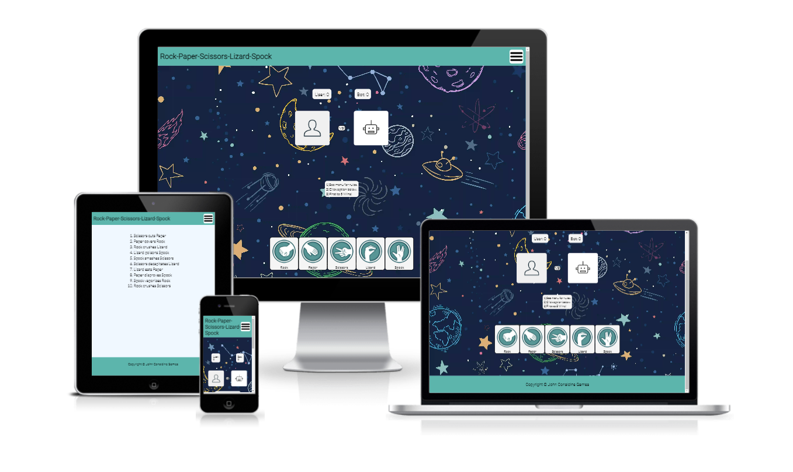

[View Rock Paper Scissors Lizard Spock on Github Pages]()

## <u>**Design Goals**</u> ##

The purpose of this game is to provide the user with an enjoyable game of chance. The main features included provide the user with the ability to play a number of turns against the computer until a winning score of five is achieved. The score is tracked and displayed for the user. The winner of each round is also displayed for the user. The overall design of the page including the game layout and colour is intended to provide a simple easy to use game while engaging the users interest on arrival to the page. The background image was chosen as galactical objects because have a relationship to both spock and the american show the Big Bang Theory where the game became more widely known. I was conscious of implementing the styles of the game in a way that meant the user did not have to scroll when they started playing so that from the scores down to the bottom options remain visable on the screen durinf gameplay. This applies mainly to smaller screens.

## <u>**Design Features**</u> ##

* **Navigation Bar**

  * Featured on both pages the navigation bars main purpose is to allow the user to navigate between the rules section and the home page where the actual game exists. The navigation bar is handled by a hamburger-menu on all screen sizes and is fully responsive. The main heading is simply the title of the game and located to the left of the header and the hamburger menu is displayed on the right.
  
  * The value of the navigation bar and main heading are that they are identical on both pages to allow for easy navigation and create a good user experience.

  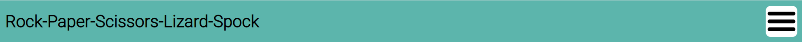 

  * **Main page**

    * On arrival to the website the user will be instantly viewing the game itself. The home page displays the game central to the page. It has the score clearly displayed above what are the two combatant boxes which represent the user and the bot. The five options for the game are displayed below these boxes and are represented by the relevant hand signals for each choice. The page is designed to provide the user with an easy to use game that has clear choices and also to display clear results to the choices the user makes while playing the game.
    The box below the combatant boxes tells the user who has won after each turn and then when the winning score is reached, it will display a message stating who is the overall winner. The same box allows the user to see the winning score required to win the game before the first game is initiated. I have also included text telling the user to check the menu for the rules and where to click to begin the game. I included these three lines of text so that the purpose of the game can immediately become evident to the user.

    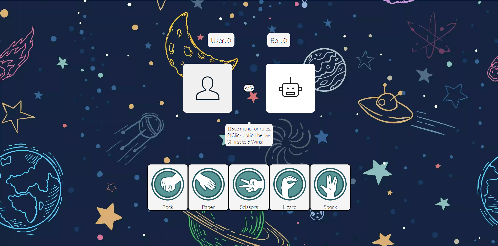

   * **Footer** 

     * The footer is a simple design which remains consistent on both pages. Its only content is the copyright for the game.

    

   * **Rules page**

     * The only other page attached to this website contains the rules of the game. The rules are defined here as the result of any choice the user makes. I gave consideration to displaying the rules on the main page and keeping the content to a single page however I came to the decision that this would have a negative impact on user experience on smaller devices such as mobile phones due to scrolling up and down. The design is intented to be just a simple set of rules that are easy to read and are not distracted by any background images.

     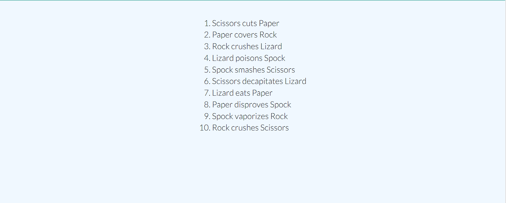
  

## **Initial Discussion**

Rock-Paper-Scissors-Lizard-Spock is a simple easy to play game intended for use by all ages. The website is intended to have a simple layout which only provides the information required to play the game. The intention was to design a layout that is eye catching to the user and is not a distraction from the game itself. The user and bot images are simple blacklines with a background image so as to provide a positive response when the box is populated by a user choice which then also selects a bot choice.

 

* **Key Information**

  * How to play the game.
  * The rules of the game.
  * How the user wins or loses each turn.
  * How many points to win the game.
  * What happens when the user wins the game.
  * what happens when the bot wins the game. 
  * Does the game reset after the required winning score is reached.

 

* **Client Goals**

  * To be able to view the site on a range of devices including a smartphone, a tablet and a laptop.
  * To make the site informative without having too much information to allow users to easily see the essential details.
  * To provide easy navigation throughout the site so users can easily navigate to and from both pages.
  * To allow quick and easy gameplay.
  * To display a winner and loser at the end of each completed game.
  * To allow the next click on the choices to begin the next game.

 

* **First Time Visitor Goals**

  * I want to view the rules of the game before playing.
  * I want easy navigation from the game to the rules page and back again.
  * I want to see who wins and loses after each turn so I do not have to keep returning to the rules to understand what is   happening during gameplay.
  * I want to have a clear message on the screen to inform me if I win or lose the game.
  * I want the game to quickly reset so I can play again after completion of each game.

 

* **Returning Visitor Goals**

  * The game was simple and fun on my first visit to this site and I want to be encouraged to return and play again as many times as I want.
  * I want to try my luck at beating the bot by a better winning margin.
  
 
 
* **Frequent Visitor Goals**

  * I want to return to this site multiple times to continue to try better my previous best winning margin. 

## **Wireframes**

 The following images are the wireframe created for the main page and the rules page. I gave consideration to using a wireframe tool but instead I opted to wireframe the game using pencil and paper. The design is relatively simple and only one page required more than a single box so this is my reasoning behind using this method.

 * **Main Page**

 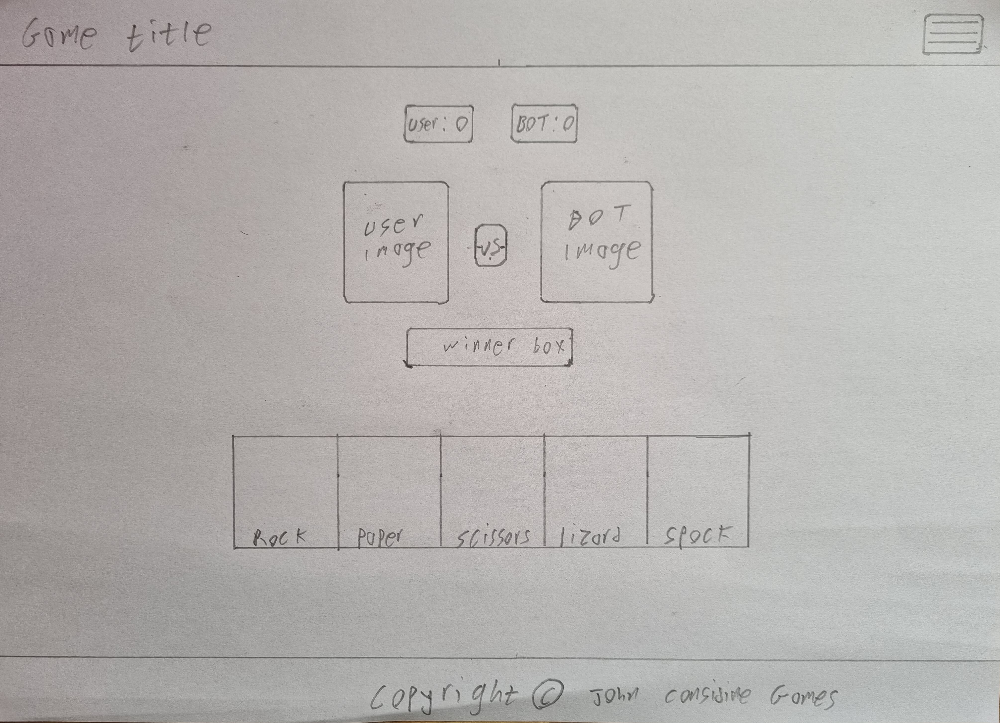

 * **Rules Page**

 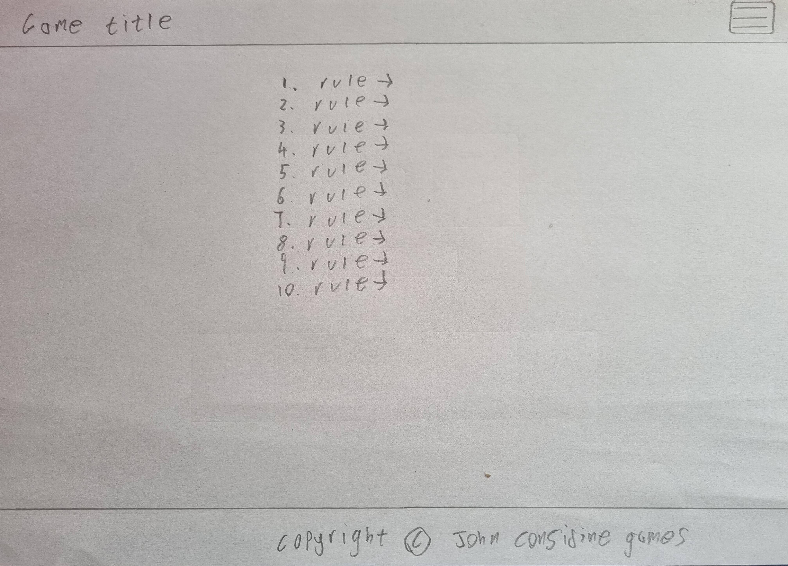

 ## <u>**Designs**</u>

* **Colour Scheme**

  * The colour I selected for the footer and header is rgb(92, 181, 172). I originally had a darker shade of this colour but when I tested it on [wave](https://wave.webaim.org/) which is an accessibility tool for the web, the contrast between the text and the background colours on the header and footer was insufficent and was displaying an error. I selected this colour because it is closely related to the colour displayed inside the downloaded game option images. I selected this colour from [W3Schools](https://www.w3schools.com/colors/colors_rgb.asp) RGB calculator. I changed to rgb(92, 181, 172) and tested again and no errors were displayed.

  * The other colours displayed on the site are whitesmoke and black. The whitesmoke colour was chosen for the purpose of emphasising the foreground display. Black was used for all font colours and a black underline was used for the hover action on the displayed nav menu. They are basic colours at each of end of the colour spectrum but I felt they perfectly suited this project.

* **Colour images**  

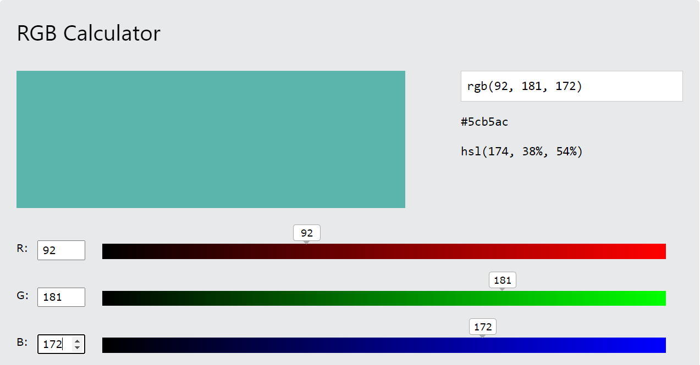

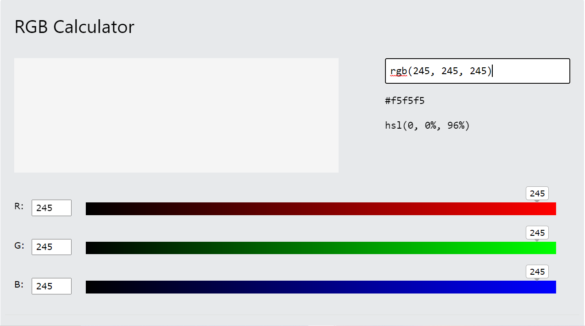

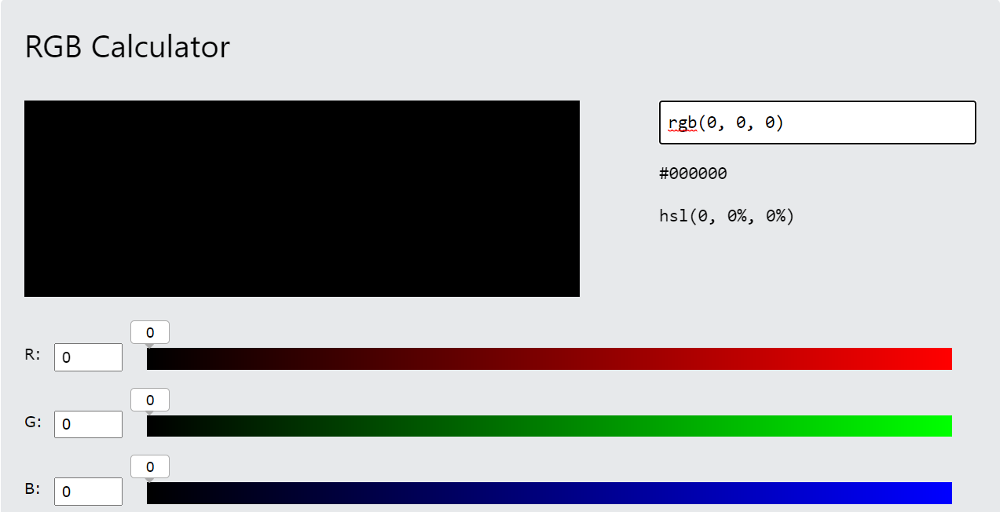

 

* **Font-family**

  * Roboto was used for the headings and copyright on the site. It is a Sans-Serif font. The back up font selected was San-Serif.

  * Lato was used for the body of the site. It is also a Sans-Serif font. The back up font selected was Sans-Serif.

* **Imagery**

  * All imagery was used with the permission of their owners. I have credited all of these in the Credits section of this README.md File.
 

## <U>**Accessibility**</U>

* I have been conscientious of achieving the maximum amount of accessibility possible by completing the following actions:

  * Using semantic HTML.

  * Using alt attributes with images on the site or aria-labels in the cases where the images were placed in the CSS file. The method of achieving this is displayed in the credits of this readme.md file.

  * Ensuring sufficent colour contrast throughout the site. This was ensured by testing the website on [wave](https://wave.webaim.org/). The two links below are the results of these tests.

  [Main page accessibility test](https://wave.webaim.org/report#/https://8000-johncci-rockpaperscisso-igo6l1zb96j.ws-eu67.gitpod.io/)

  [Rules page accessibility test](https://wave.webaim.org/report#/https://8000-johncci-rockpaperscisso-igo6l1zb96j.ws-eu67.gitpod.io/rules.html)

 

## <U>**Technologies used and Implemented**</U>

* The following technologies were used and implemented in the construction and design of this website.

  * HTML, javaScript and CSS - To create this website.

  * Git - For version control.

  * Github - To save and store the files for the website construction.

  * Google Fonts - To import the fonts used on the website.

  * Google dev tools - To troubleshoot and test features and to monitor and adjust the website to ensure it is responsive.

  * Am I Responsive? - To show the website image on a range of devices.

  * NVaccess.org - To test the alt and aria-label attributes.

  * Wave.webaim.org - To test accessibility of the website.
 

## <U>**Testing and Bugs**</U>

* Testing was an ongoing process from the start to the finish of the build. I used chrome developer tools to assist me in solving problems as I progressed through the project. I encountered the following build issues and bugs as I progressed through the project.

 * The hamburger menu would not perform as expected. The contained nav bar was intended to display central when clicked but it displayed at the top of the opened box. I corrected this by targetting the css through javaScript and had it display as a flex property.

 * The hamburger menu also needed to be double clicked to open on arrival to the page, after it was clicked the first time it would respond to a single click and operate as expected. I am still not aware of why this was happening ,however after changing core javaScript to JQuery this problem was resolved and it now opens with a single click. This is no longer an issue for the functionality of my website but I have attached an image of the unfixed bug below.

 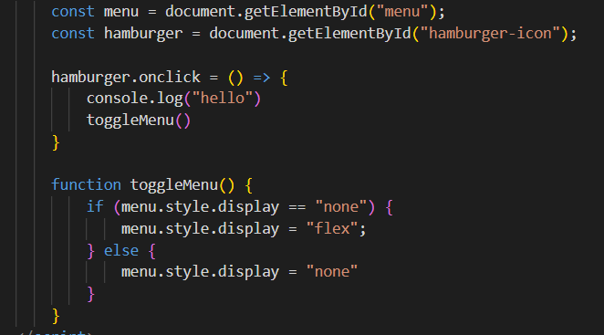

 * During the course of building this website, I was focused on testing responsiveness by decreasing the screen width and then adjusting the media queries accordingly. It was only near the end of the build that I turned my phone to auto rotate and observed that the main content was overflowing into the heading and the footer when the screen was horizontal. I experimented with padding and margin styles to try resolve this problem but was unsuccessful. I eventually solved the problem by simply applying a min-height to the main-content div which holds the main background image.

 * I encountered some issues with restting the game when the winning score was reached. I originally used a method where the page actually reloaded when the winning score was reached using reload and clearInterval functions which I found on the website [mdn web docs](https://developer.mozilla.org/en-US/docs/Games/Tutorials/2D_Breakout_game_pure_JavaScript/Finishing_up). This worked to reset the game except the final message displaying the winner was displayed and then reset too quickly for the user to read. I resolved this by adding a simple function to the winning botscore and userscore and deleting my previous reset method.

 ## <U>**W3C Validator**</U>

* The W3C validator was used to to validate the html on all pages of this website. No errors were returned when passing through the W3C validator.
 
  * [Main Page HTML](https://validator.w3.org/nu/?doc=https%3A%2F%2F8000-johncci-rockpaperscisso-igo6l1zb96j.ws-eu67.gitpod.io%2Findex.html)
  * [Rules Page HTML](https://validator.w3.org/nu/?doc=https%3A%2F%2F8000-johncci-rockpaperscisso-igo6l1zb96j.ws-eu67.gitpod.io%2Frules.html)
  
 

* The offical Jigsaw Validator was used to validate the CSS on the website. No errors were found when passing through the Jigsaw validator.
 

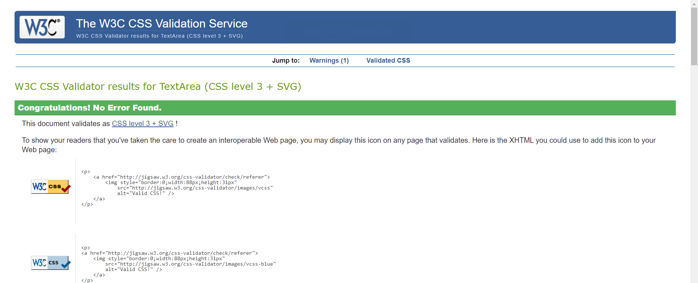
 

## <U>**javaScript Testing**</U>

[JSHint](https://jshint.com/) was used to check the functionality of the javaScript code. No significant issues recorded. The JQuery declarations were not recognoised and shown as undefined variables as jShint only reads core javaScript.

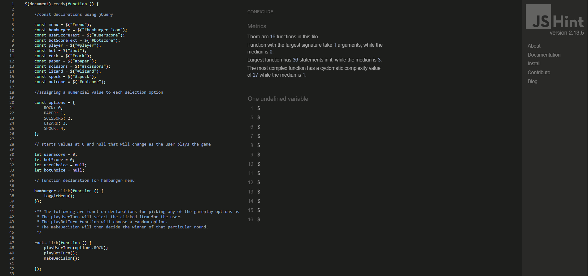
 

## **Final Testing User Goals** 

* Device testing

  * I performed testing on the following devices - Samsung S21+ , Samsung S10 and Huawei MateBook D15. I also used google chrome developer tools to check the sites responsiveness on the following devices - iPhone SE, iphone XR, iphone 12 pro, Pixel 5, Samsung Galaxy S8, Samsung Galaxy S20 Ultra, ipad Air, Surface Pro 7, Surface Duo, Galaxy Fold, Samsung Galaxy A51/71, Nest Hub, Nest Hub Max. All tests showed the website to perform as expected.

* Browser testing

  * I performed testing on using the following browsers - Google Chrome ,Safari ,Mozilla Firefox. All tests showed the website to perform as expected.

* Header

  * I tested the hamburger menu on each page and it displayed the page options when clicked.

  * I tested the nav bar to ensure that the links worked as expected from the home page. Each link brought me to the required location when selected.

  * I tested the nav bar to ensure that all links worked as expected from the rules page. Each link brought me to the required location when selected.

* Gameplay

  * I tested the game multiple times with the aim of clicking on every option and viewing all possible outcomes to verify the game functioned as expected.
  
  * When rock was clicked and the bot selection was lizard or scissors a message was displayed declaring the user the winner and the score increased by one for the user. When the bot also displayed rock, a message appeared declaring the game turn a tie.
  When the bot selection was paper or spock a message appeared delaring the bot the winner and the bot score was increased by one.

  * When paper was clicked and the bot selection was rock or spock a message was displayed declaring the user the winner and the score increased by one for the user. When the bot also displayed paper, a message appeared declaring the game turn a tie.
  When the bot selection was scissors or lizard a message appeared declaring the bot the winner and the bot score was increased by one.

  * When scissors was clicked and the bot selection was paper or lizard a message was displayed declaring the user the winner and the score increased by one for the user. When the bot also displayed scissors, a message appeared declaring the game turn a tie.
  When the bot selection was rock or spock a message appeared delaring the bot the winner and the bot score was increased by one.

  * When lizard was clicked and the bot selection was spock or paper a message was displayed declaring the user the winner and the score increased by one for the user. When the bot also displayed lizard, a message appeared declaring the game turn a tie.
  When the bot selection was scissors or rock a message appeared delaring the bot the winner and the bot score was increased by one.

  * When spock was clicked and the bot selection was rock or scissors a message was displayed declaring the user the winner and the score increased by one for the user. When the bot also displayed spock, a message appeared declaring the game turn a tie.
  When the bot selection was lizard or paper a message appeared delaring the bot the winner and the bot score was increased by one.

  * When the game score reached five for either the user or the bot a message was displayed showing the correct winner. The next turn then started a new game. These functions all operated as expected.
 

## <u>**LightHouse**</u>
## **Final Testing User Goals** 

* I applied the lighthouse tool to this project which is located in the Chrome Developer Tools. There are four areas tested in the lighthouse test.

  * Performance
  * Accessibility
  * Best Practices
  * SEO
 

### **Main Page**

The following images in this section are displayed as lighthouse desktop as the first image and lighthouse mobile as the second image.
 

1. The first lighthouse scores for performance on mobile was 76 and 92 on desktop. I improved this score to the figures displayed below by optimising all of my images and changing the format to webp using ezgif.com. The accessibility score was 91 for this page. This was due to the buttons not having a means of identification by screen readers. I improved this score to the score displayed below by adding aria-labels to the buttons. 

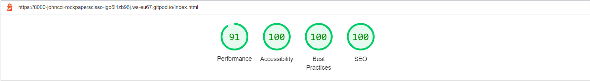
 

### **Rules Page**

The following images in this section are displayed as lighthouse desktop as the first image and lighthouse mobile as the second image.
 

1. The rules page has only background colour and no images so the lighthouse scores have been as displayed below from the beginning fo building this project.

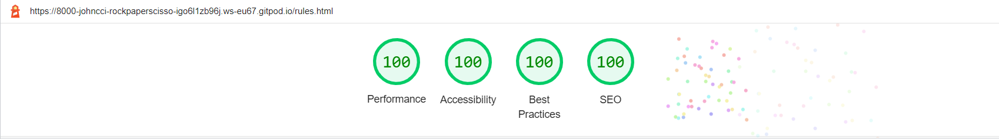

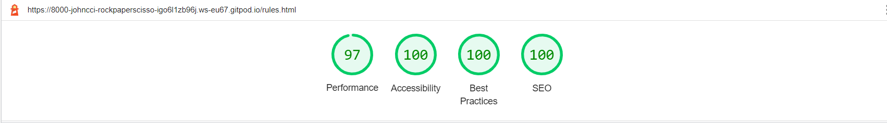
 

## <u>**Deployment and Local Development**</u>

### **Deployment**

The live website was deployed by following the instructions below. Github pages was used to achieve this.

  1. Log in to GitHub.
  2. Find the repository named summer-soccer-camp.
  3. click on the settings link.
  4. Once in settings, navigate to the pages tab on the side menu.
  5. Under source, Select the branch to main, then click save.
  6. Once the main branch has been selected, the page will be automatically refreshed with a detailed ribbon display to indicate a successful deployment.
 

  ### **Local Development**

To fork the Rock/Paper/Scissors/Lizard/Spock repository:

  1. Log in to GitHub.
  2. Go to the repository for this project, johncci/Rock/Paper/Scissors/Lizard/Spock game.
  3. Click the fork button located near the top right corner of the page.
 

To clone the Rock/Paper/Scissors/Lizard/Spock repository:
  1. Log in (or sign up) to GitHub.
  2. Go to the repository for this project, johncci/Rock/Paper/Scissors/Lizard/Spock game.
  3. Click on the code button, select whether you would like to clone with HTTPS, SSH or GitHub CLI and copy the link shown.
  4. Open the terminal in your code editor and change the current working directory to the location you want to use for the cloned directory.
  5. Type 'git clone' into the terminal and then paste the link you copied in step 3. Press enter.
 

## <u>**Libraries**</u>

* jQuery is the only library used for this website. The reason I chose to use this library was for readability and just to make the code appear tidier. I am aware that it was not really necessary to use jQuery to build this website but i decided that it was beneficial and educational to me to write the code using core javaScript and then use W3Schools documentation for reference to write the jQuery code. The main device used to implement this plan was the website SyncFiddle which I used as a testing area for this website.

## <u>**Credits**</u>

### **Content**

  * The method I used to position items as by using flex. I learned how to apply [Flex Positioning](https://www.w3schools.com/css/css3_flexbox.asp) at W3C schools.

  * The javaScript library use for this website is jQuery and I learned how to apply this library using [jQuery](https://www.w3schools.com/jquery/jquery_intro.asp) at W3Schools.

  * The idea for the code to create the aria-labels for images in the CSS file was provided to me by tutor support who suggested a a website where I could learn how to do this. The website I accessed to write the code for the aria-label is [davidmacd.com](https://www.davidmacd.com/blog/alternate-text-for-css-background-images.html).
 

### **Media**

  * The icon/image for the hamburger menu was taken from [icon-libarary.com](https://icon-library.com/).
  * The images for the five game choices were downloaded from [icon-libarary.com](https://icon-library.com/).
  * The images for the bot and user images were downloaded from [pixabay](https://pixabay.com/images/search/avatar/).
  * The images on this site were changed from there original settings using [ezgif.com](https://ezgif.com/).
  * The font for this page was set using [googlefonts.com](https://fonts.google.com/). 
  * The alt and aria-label attributes were tested using [NVaccess.org](https://www.nvaccess.org/download/).
  * The accesibility of the website was checked using [WAVE (Web Accessibility Evaluation Tool)](https://wave.webaim.org/)
  * The background image used in this website was downloaded from [freepik.com](https://www.freepik.com/search?format=search&query=space%20background).

  All media listed above was used with the permission of the owner.
 

  ### **Acknowledgments**

   I would like to thank the following people who gave up their time to help me in completing this website.

    * Antonio Rodriguez - My Mentor who offered his help both by appointments and outside appointment hours and never failed to point me in the right direction when I was struggling to find solutions to existing bugs. He also helepd keep me motivated in my initial struggles with javaScript.

    * Code Institute Tutors - For assisting me with various issues throughout the project and never failing to point me in the right direction.

    * Slack community - For helping me with various problems I have had during the build of this project.

 

